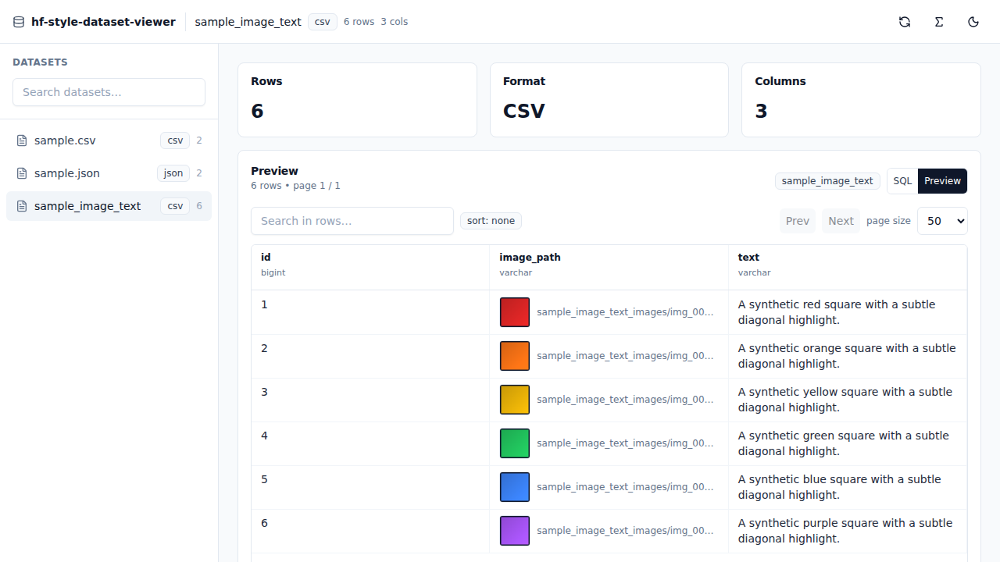
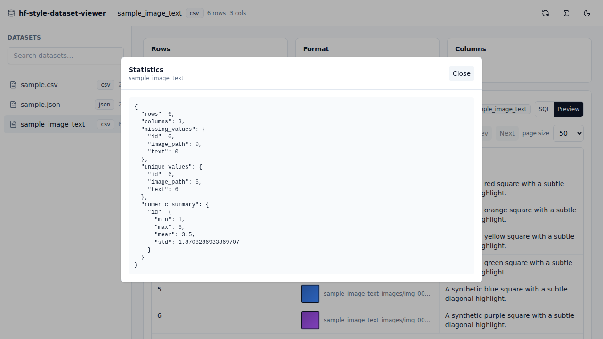
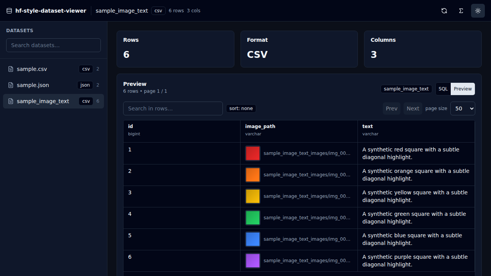
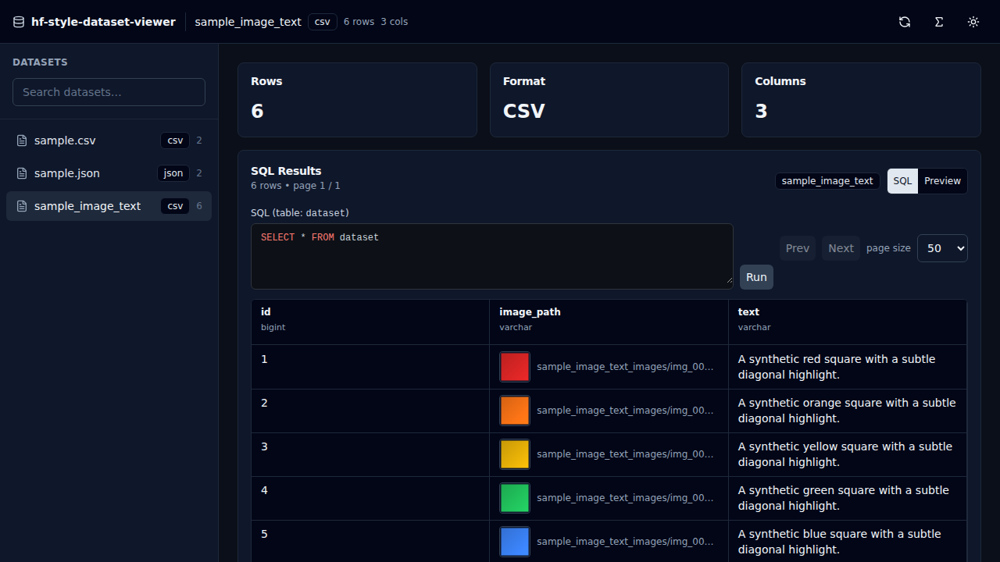

# hf-style-dataset-viewer

A local-first dataset explorer inspired by the Hugging Face Dataset Viewer.

`hf-style-dataset-viewer` is a self-hosted dataset explorer for browsing datasets stored on disk without uploading them to the cloud.

- No accounts
- No auth
- No telemetry
- No external APIs
- Runs entirely on `localhost`

## Features

- Local dataset discovery (`./datasets`)
- Fast backend preview with DuckDB
- Table viewer with sticky header + horizontal scroll
- Server-side pagination, sorting, and global search
- SQL query editor (DuckDB, local)
- Image thumbnails for `*.png/*.jpg/*.webp` path columns (e.g. `image_path`)
- Row virtualization for smooth scrolling
- Dataset statistics endpoint (missing/unique/numeric summaries)

## Architecture

```
hf-style-dataset-viewer/
  datasets/
  backend/   (FastAPI + DuckDB + Polars)
  frontend/  (React + Vite + Tailwind + TanStack Table/Virtual + Zustand)
```

Frontend (`http://localhost:5173`) talks only to the local backend (`http://localhost:8000`).

## Screenshots

Screenshots below use the included `sample_image_text` dataset (image + text).







## SQL search (DuckDB, local)

SQL search runs entirely on your machine using DuckDB. When you switch to **SQL** mode, the backend creates an in-memory DuckDB connection and exposes your dataset as a view named `dataset`. Your query must reference `dataset` and must be a single `SELECT`/`WITH` statement (no writes / DDL).



Example:

```sql
SELECT id, problem, solution
FROM dataset
WHERE source = 'synthetic_math' AND problem ILIKE '%Solve%'
ORDER BY id
```

## Getting Started

### Prerequisites

- Node.js 20+ (works with newer versions)
- Python 3.12+

### 1) Add datasets

Drop files into `./datasets`:

- `*.csv`
- `*.json` (array of objects)
- `*.parquet`

Sample datasets are included in `datasets/`.

Image-text datasets are supported by adding a column with image paths (for example `image_path`) that point to image files under `./datasets` (including subfolders). The UI will render thumbnails in the table preview.

### 2) Start the backend

From the repo root:

```bash
python -m venv .venv
. .venv/bin/activate
pip install -r backend/requirements.txt
uvicorn backend.api.main:app --reload --port 8000
```

Optional:

- `HF_STYLE_DATASETS_DIR=/absolute/path/to/datasets` (defaults to `./datasets`)

### 3) Start the frontend

In a separate terminal:

```bash
cd frontend
npm install
npm run dev
```

Optional:

- `VITE_API_BASE_URL=http://localhost:8000`

### 4) Open the UI

Visit `http://localhost:5173`.

## Backend API

- `GET /datasets`
- `GET /datasets/{name}/schema`
- `GET /datasets/{name}/stats`
- `GET /datasets/{name}/preview?page=1&page_size=100&search=...&sort_by=...&sort_dir=asc|desc`
- `POST /datasets/{name}/query`
- `GET /datasets/{name}/statistics`

## Roadmap

- JSONL / Arrow / HF Datasets support
- Better schema + type rendering (nested values)
- Column statistics UI (not just JSON output)
- Semantic search + embeddings (local-first)
- Dataset annotations and versioning

## Contributing

See `CONTRIBUTING.md`.

## License

MIT — see `LICENSE`.
